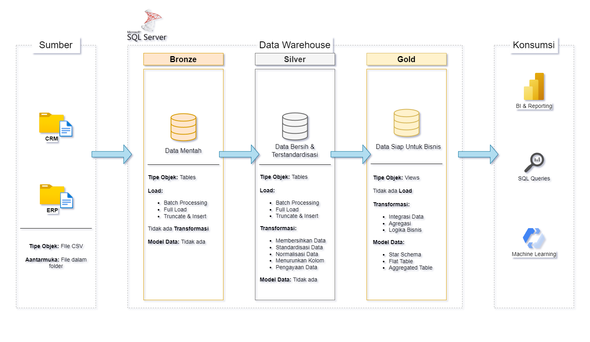

# Data Warehouse Project
  
Proyek ini mendemonstrasikan solusi data warehousing lokal dengan meggunakan SQL Server. Dirancang sebagai proyek portofolio, proyek ini menyoroti praktik membangun data warehouse.

---
## Data Architecture

Arsitektur data untuk proyek ini mengikuti Arsitektur Medali, lapisan **Bronze**, **Silver**, dan **Gold**:

1. **Lapisan Bronze**: Menyimpan data mentah apa adanya dari sistem sumber. Data diambil dari File CSV ke dalam Database SQL Server.
2. **Lapisan Silver**: Lapisan ini mencakup proses pembersihan data, standardisasi, dan normalisasi untuk menyiapkan data untuk analisis.
3. **Lapisan Gold**: Menampung data yang siap untuk bisnis yang dimodelkan ke dalam skema bintang yang diperlukan untuk pelaporan dan analitik.

---
## Project Overview

Proyek ini meliputi:

1. **Arsitektur Data**: Mendesain Data Warehouse Modern Menggunakan Arsitektur Medali, lapisan **Bronze**, **Silver**, dan **Gold**.
2. **ETL Pipelines**: Extracting, transforming, and loading data dari sistem sumber ke dalam warehouse.
3. **Data Modeling**: Mengembangkan tabel fakta dan dimensi yang dioptimalkan untuk kueri analitik.

---

## Important Links & Tools:

- **[Datasets](datasets/):** Access to the project dataset (csv files).
- **[SQL Server Express](https://www.microsoft.com/en-us/sql-server/sql-server-downloads):** Server ringan untuk menghosting database SQL.
- **[SQL Server Management Studio (SSMS)](https://learn.microsoft.com/en-us/sql/ssms/download-sql-server-management-studio-ssms?view=sql-server-ver16):** GUI untuk mengelola dan berinteraksi dengan database.
- **[DrawIO](https://www.drawio.com/):** Merancang arsitektur data, model, aliran, dan diagram.
- **[Notion](https://www.notion.com/):** Alat bantu lengkap untuk manajemen dan organisasi proyek.

---

## Notion Project Steps
**[Notion Project Steps](https://fluorescent-nurse-a01.notion.site/Data-Warehouse-Project-1abd95765fef809684b3c545e7ca970e?pvs=4):** Akses ke Semua Fase dan Tugas Proyek.

---

## Project Requirements

### Membangun Data Warehouse

#### Objektif
Mengembangkan data warehouse modern menggunakan SQL Server untuk mengkonsolidasikan data penjualan, memungkinkan pelaporan analitis dan pengambilan keputusan yang tepat.

#### Spesifikasi
- **Sumber Data**: Mengimpor data dari dua sistem sumber (ERP dan CRM) yang disediakan sebagai file CSV.
- **Kualitas Data**: Membersihkan dan menyelesaikan masalah kualitas data sebelum analisis.
- **Integrasi**: Menggabungkan kedua sumber menjadi satu model data tunggal yang mudah digunakan yang dirancang untuk kueri analitik.
- **Cakupan**: Fokus pada dataset terbaru saja; historisasi data tidak diperlukan.
- **Dokumentasi**: Menyediakan dokumentasi yang jelas tentang model data untuk mendukung pemangku kepentingan bisnis dan tim analitik.
